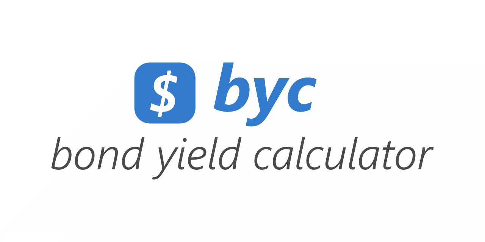

# Bond Yield Calculator (byc)

This CLI calculates **Current Yield** and **Simple Yield** for plain-vanilla bonds.

## Features

- **Yield calculation**: current and simple yield
- **CSV format**: reads and writes to CSV files
- **Tests**: tests for maturity and yield
- **Batch Generation**: Multiple calculations in a single run
- **File Export**: Save calculated yields a file
- **Simple CLI**: Easy-to-use command-line interface with sensible defaults
- **Proper Error Handling**: Uses `anyhow` for clear, contextual error messages

## Mock Data

[You can use the mock data file from `./data/bonds.csv` (or .\data\bonds.csv in Windows Powershell).](data/bonds.csv)

## Formulas

You can find the math formulas and assumptions [in the formulas.md file.](formulas.md)

## Installation

### Download Binaries

You can download [the binary file from the Releases section.](https://github.com/krondorl/byc/releases)

Choose a binary to download in browser or with `curl`.

#### Linux

```bash
# download
# always check for latest version and architecture at releases section
# 0.1.0, 0.2.0, etc.
curl -L -o byc https://github.com/krondorl/byc/releases/download/v0.1.0/byc-linux-x64-v0.1.0

# add running right
chmod +x byc

# execute using included mock data
./byc ./data/bonds.csv ./data/bonds.enriched.csv
```

#### macOS

```bash
# download
# always check for latest version at releases section
# 0.1.0, 0.2.0, etc.
curl -L -o byc https://github.com/krondorl/byc/releases/download/v0.1.0/byc-macos-arm64-v0.1.0

# add running right
chmod +x byc

# remove quarantine
xattr -d com.apple.quarantine byc

# execute using included mock data
./byc ./data/bonds.csv ./data/bonds.enriched.csv
```

#### Windows (Powershell)

```powershell
# download
# always check for latest version at releases section
# 0.1.0, 0.2.0, etc.
curl -L -o byc https://github.com/krondorl/byc/releases/download/v0.1.0/byc-windows-x64-v0.1.0.exe

# run
.\byc.exe .\data\bonds.csv .\data\bonds.enriched.csv
```

**Note:** Always check [the latest binary files from the Releases section.](https://github.com/krondorl/byc/releases)

### From Source

```bash
# Clone the repository
git clone https://github.com/krondorl/byc.git
cd byc

# Run on Windows
cargo run -- .\data\bonds.csv .\data\bonds.enriched.csv

# Run on Linux and Mac
cargo run -- ./data/bonds.csv ./data/bonds.enriched.csv

# Build release
cargo build --release
```

### Prerequisites

- Rust 1.92.0 or higher
- Cargo package manager

## Usage

### Linux and macOS

```bash
# Process csv file
./byc ./data/bonds.csv ./data/bonds.enriched.csv

# View help
./byc --help

# Check version
./byc --version
```

### Windows (Powershell)

```bash
# Process csv file
.\byc.exe ./data/bonds.csv ./data/bonds.enriched.csv

# View help
.\byc.exe --help

# Check version
.\byc.exe --version
```

## Dependencies

```toml
[dependencies]
anyhow = "1.0.100"
chrono = "0.4.42"
clap = { version = "4.5.53", features = ["derive"] }
csv = "1.4.0"
serde = { version = "1.0.228", features = ["derive"] }
```

## License

Please see [the license file](LICENSE.md).

## Links

- **Rust CLI book**: https://rust-cli.github.io/book/index.html
- **Rust Documentation**: https://doc.rust-lang.org/
- **Clap CLI**: https://docs.rs/clap/
- **Anyhow**: https://docs.rs/anyhow/

## History

### 2026-01-03

- Social preview images
- Documentation

### 2026-01-02

- CSV crate
- Working version

### 2026-01-01

- Initial repo
- Module sketches
- Crates
- Maturity calculation
- CLI basics

## Financial Disclaimer

**Educational Use Only**

This software is provided for educational and informational purposes only and does **not** constitute financial, investment, trading, or legal advice.

- Bond yield calculations are simplified and may not reflect real-world market conditions
- Results may differ from broker, exchange, or institutional calculations
- No consideration is given to taxes, fees, liquidity, credit risk, inflation, or reinvestment risk
- Simple Yield is an approximation and should not be used as a substitute for Yield to Maturity (YTM)

**No Liability**

The authors and contributors assume **no responsibility or liability** for any errors, omissions, or financial losses arising from the use of this software.

Use this tool at your own risk. Always consult qualified financial professionals before making investment decisions.